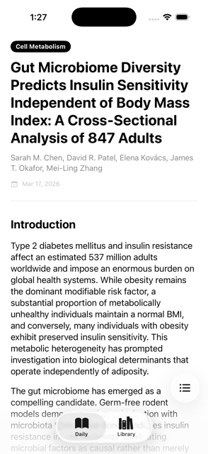
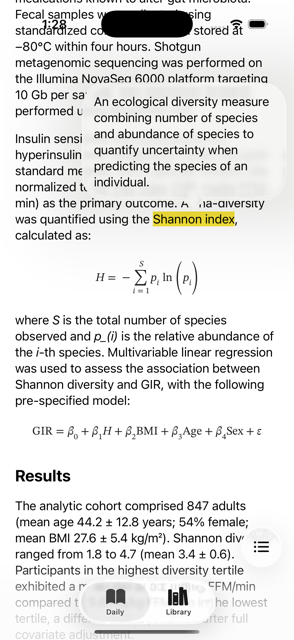
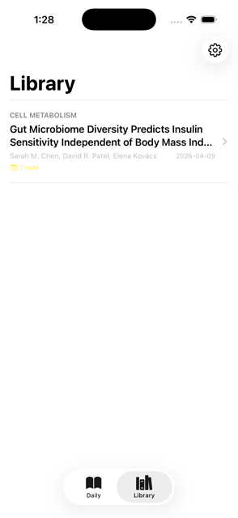

# Daily Dose


Daily Dose is an iOS application that delivers a randomly selected open-access scientific article every morning, designed to help non-specialists build a habit of reading primary research.

## Tech Stack Overview

- **Frontend**: Built natively with Swift, SwiftUI, SwiftData, and TextKit 2 for a robust, offline-first reading experience.
- **Backend**: Automated via a Python cron job on GitHub Actions, which outputs a standardized JSON payload hosted on GitHub Pages (static CDN), ensuring zero hosting costs and no server to maintain.

## App Features / User Guide

### Exploring the Daily Article

Each day, a new scientific article is ready for you in the **Daily** tab. The app presents the content in an easy-to-read, formatted view. While reading, you can access a menu to easily explore the text by jumping to specific **Sections**, viewing a list of your **Notes**, or using **Search** to find specific words or phrases.



### Highlighting and Annotating

You can highlight and add personal notes to passages you find interesting:
- **Text**: Use the standard text selection to highlight a sentence, then choose "Annotate" from the menu to add your thoughts.
- **Tables and Math**: Tap on a specific table cell or mathematical equation to attach a note directly to it. 



To review, edit, or delete an annotation, simply tap on any custom highlighted section within the article.

### Saving to Your Library

When you find an article you want to keep, you can save it to your local library. From the Daily tab, swipe right across the screen to toss the article into your collection.



### The Library Tab
Your saved articles are stored chronologically in the **Library** tab. Here you can review your saved articles, see how many notes you took for each, dive back into reading them at any time, or delete them when you're finished. 

From the Library tab, you can also access the **Settings** menu to customize the app's display mode (System, Light, or Dark) and adjust your preferred highlight color.

## Developer Setup & Installation

Daily Dose is designed with zero external package dependencies to ensure a clean and fast build.

1. **Clone the repository**:
   ```bash
   git clone https://github.com/lukesj28/daily-dose.git
   cd daily-dose
   ```
2. **Open the project**:
   Open `ios-app/DailyDose.xcodeproj` in Xcode.
3. **Check your deployment target**:
   Ensure your deployment target is set to **iOS 26.0** or newer (required for advanced TextKit 2 text rendering features).
4. **Build and Run**:
   Build and run the application on your simulator or device.

## Contributing

We welcome contributions to Daily Dose! If you have suggestions for improvements, please feel free to open an issue or submit a pull request.

## Contact & Support

For questions, feedback, or bug reports, please [open an issue](https://github.com/lukesj28/daily-dose/issues/new) in this repository or reach out directly.

## Acknowledgments

A special thanks to the National Library of Medicine (NLM) and the National Center for Biotechnology Information (NCBI) for providing access to the PubMed Central (PMC) Open Access Subset via their E-utilities API.

## Medical Disclaimer

This application is for informational and educational purposes only and does not constitute professional medical advice, diagnosis, or treatment.

## License & Copyright

The source code for this iOS application and backend ingestion script is licensed under the MIT License. However, the data generated, cached, and distributed within public/today.json is sourced dynamically from the PubMed Central (PMC) Open Access Subset. This data remains the copyright of its respective authors and is distributed under various open-access licenses. This repository and application are not affiliated with or endorsed by the NLM or NCBI.
